GDG ChatBot
===
部屬
---
### Dify ([GitHub](https://github.com/langgenius/dify?tab=readme-ov-file)) -> 將 port 改成5001
#### 1. quickstart
```
git clone https://github.com/langgenius/dify.git
cd dify/docker
cp .env.example .env
```
#### 2. 修改 .env  
將 dify / docker / .env 中的
```
EXPOSE_NGINX_PORT=80
EXPOSE_NGINX_SSL_PORT=443
```
改成
```
EXPOSE_NGINX_PORT=5001
EXPOSE_NGINX_SSL_PORT=5443
```
#### 3. 啟動 Dify
```
docker compose -p dify up -d
```
#### 4. 開啟 Dify 頁面
```
http://localhost:5001/install
```

### DigiRunner ([GitHub](https://github.com/TPIsoftwareOSPO/digiRunner-Open-Source?tab=readme-ov-file)) -> 使資料能夠儲存起來
#### 1. 建立專用 Docker Volume
```
docker volume create h2-dir
```
#### 2. 第一次啟動
將 ```Dspring.sql.init.mode``` 設為 ```always```
```
docker run -d --name digirunner --restart unless-stopped `
  -p 31080:18080 `
  -v h2-dir:/h2dir `
  -e "JAVA_TOOL_OPTIONS=-Dspring.sql.init.mode=always -Dspring.datasource.url=jdbc:h2:file:/h2dir/dgrdb;NON_KEYWORDS=VALUE;Mode=MySQL" `
  tpisoftwareopensource/digirunner-open-source
```
#### 3. 確認 DB 已寫入 Volume
```
docker run --rm -v h2-dir:/data alpine sh -c "ls -al /data"
```
若正確應該會看到
```
dgrdb.mv.db
```
#### 4. 切換模式 (第二次啟動)
將 ```Dspring.sql.init.mode``` 設為 ```never```
```
docker rm -f digirunner

docker run -d --name digirunner --restart unless-stopped `
  -p 31080:18080 `
  -v h2-dir:/h2dir `
  -e "JAVA_TOOL_OPTIONS=-Dspring.sql.init.mode=never -Dspring.datasource.url=jdbc:h2:file:/h2dir/dgrdb;NON_KEYWORDS=VALUE;Mode=MySQL" `
  tpisoftwareopensource/digirunner-open-source
```
#### 5. 開啟 Digirunner 頁面
```
http://localhost:31080/dgrv4/ac4/login
```
```
Username: manager
User password: manager123
```

Dify 設定
---
### 1. 註冊並登入
### 2. 建立聊天機器人
- 建立空白應用
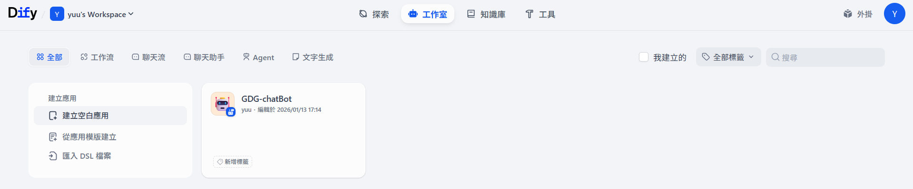
- 初學者 / 聊天助手：設定名字後建立
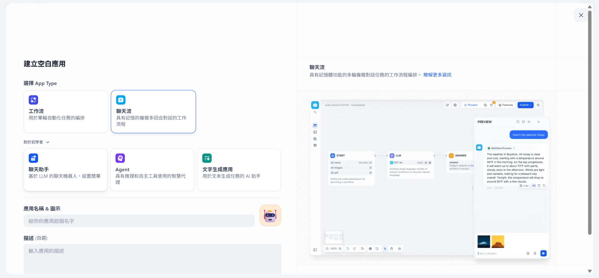
- 選取要用的 LLM 並加入 LLM 的 API Key
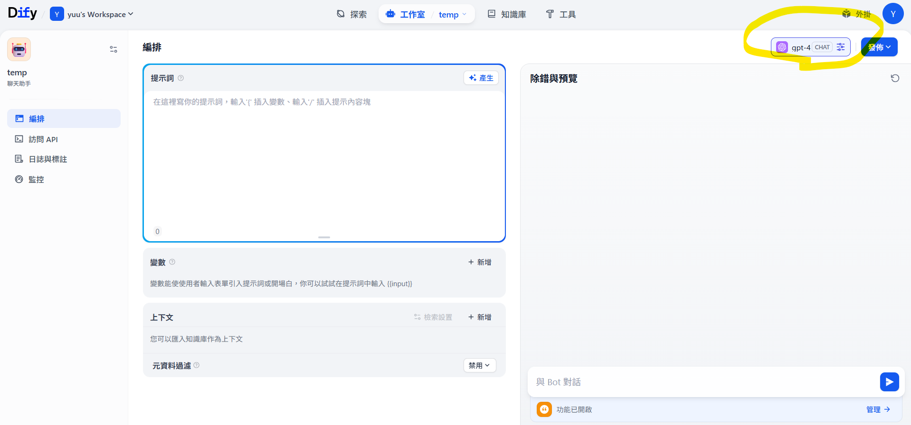
### 3. 建立知識庫
- 知識庫 / 建立知識庫：建立知識庫並隨便放一個檔案進去
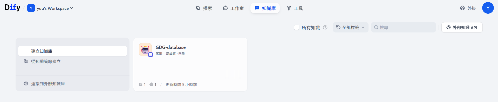
- 連接知識庫：回到機器人，在上下文中新增要選的資料庫
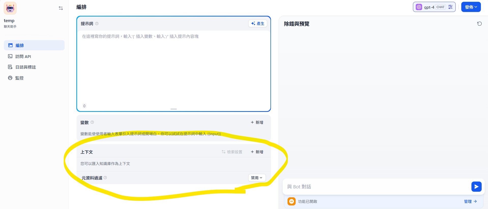
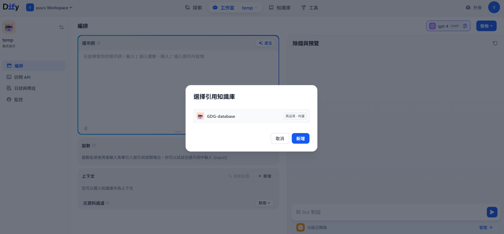
### 4. 取得 API Key
- 訪問 API / API 金鑰：取得機器人的 API Key
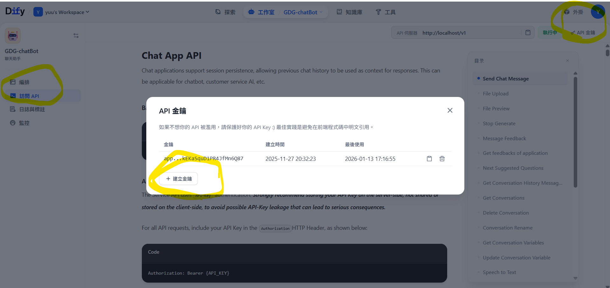

DigiRunner 設定
---
### 1. 設定 Webhook
- System Configs / Webhook / Create
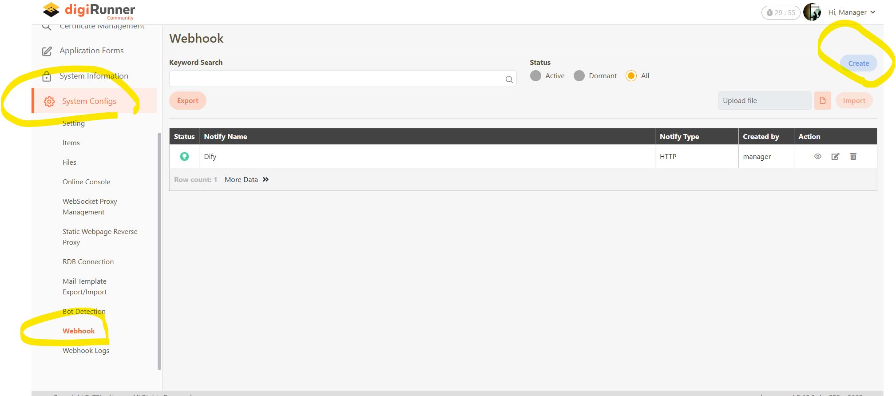
- 在 Value 中設定你的 Dify API Key，其餘部分如圖設定
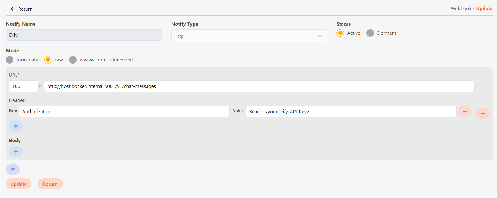
```
URL: http://host.docker.internal:5001/v1/chat-messages
Key: Authorization
Value: Bearer <Your-Dify-API-Key>
```
### 2. 註冊 API
- API managerment / API registry / customize：到註冊畫面
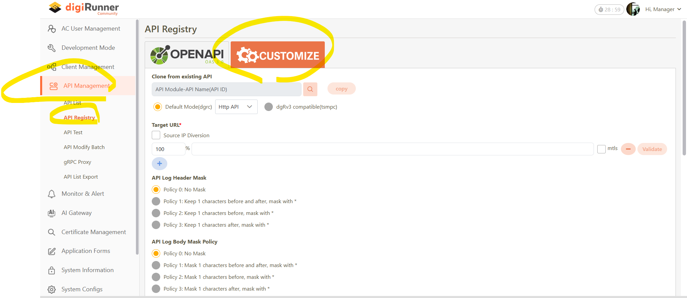
- 連接 Webhook：選 Webhook，Webhook Notify Name 選擇剛剛建好的 Webhook
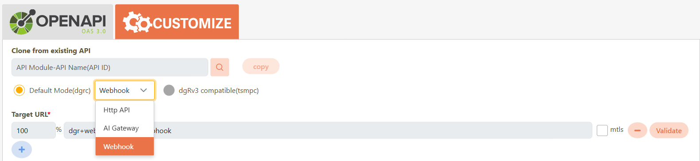
- API 設定
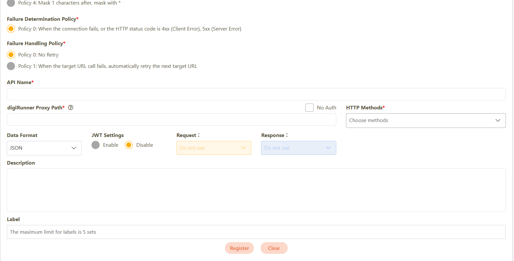
```
API name: <自己取>
digiRunner Proxy Path: /dify/chat
HTTP Methods: POST
```
### 3. 註冊 API Group
- Client Management / API Group / Create
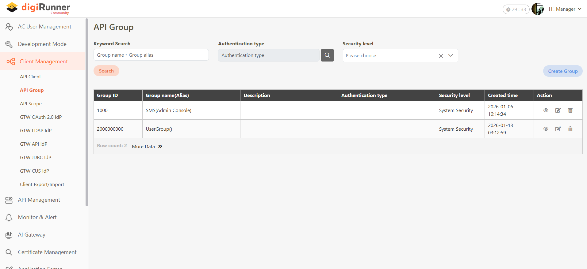
- 設定自己的 Group name 並選取剛剛建立的API (API moduls 和 APIs 都要選到)
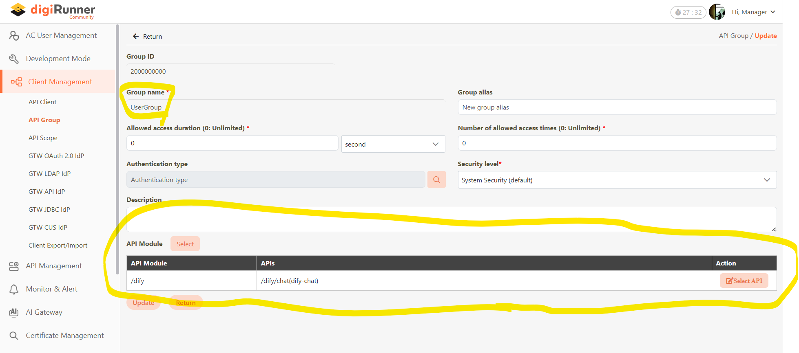
### 4. 註冊 API client
- Client Management / API Client / Create
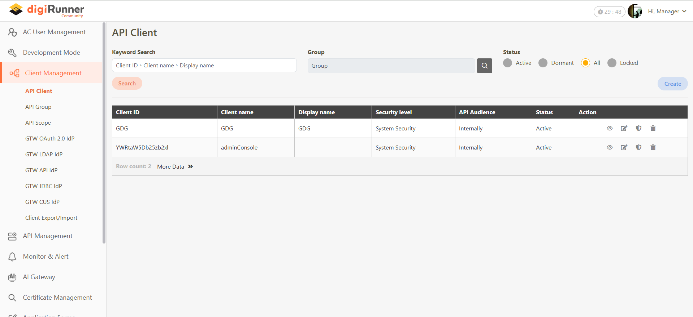
- 設定基本資料，其他不動
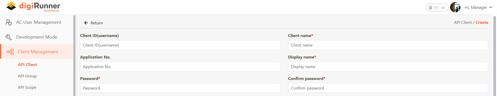
```
Client ID(username): <自己取>
Client name: <同上>
Display name: <同上>
Password: <自己設定>
```
- security: 和 Group 連接並打開連接
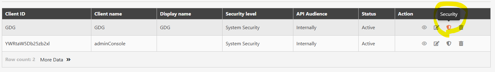
加入剛剛建立的 Group
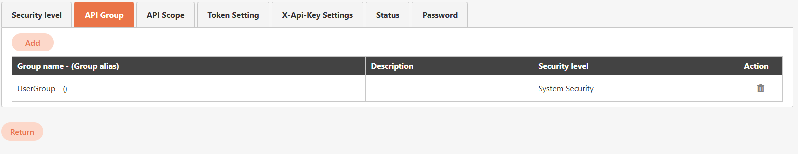
status 選擇 active
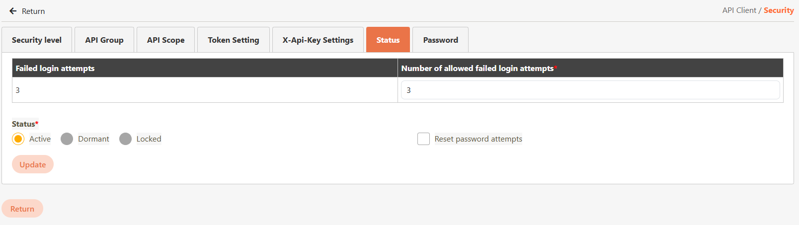
### 5. 測試
- API Management / API List / 你註冊的API / test
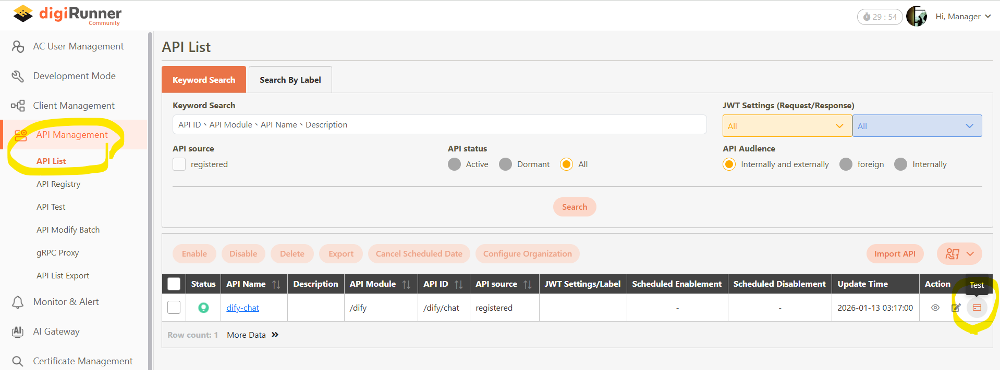
- 填入資料
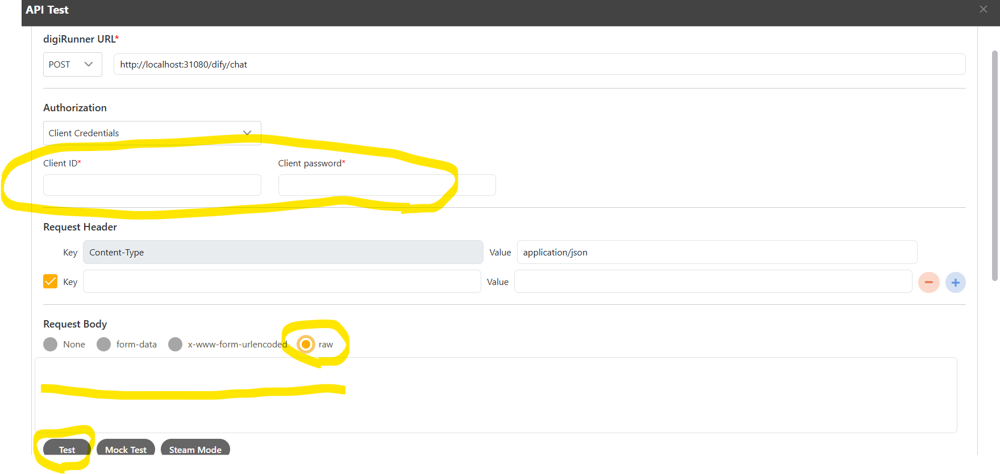
```
Client ID: <剛剛 API Client 設定的 ID>
Client password: <剛剛 API Client 設定的 password>
Request Body: row
輸入 body: {"inputs":{},"query":"hello","response_mode":"blocking","user":"test"}
```

後端
---
### 1. 建立環境
```
cd backend

python -m venv .venv
.venv\Scripts\activate

pip install -r requirements.txt
```
### 2. 設定環境變數
```
copy .env.example .env
```
將 client id 和 secret 改為你的 ID 和密碼
### 3. 執行
```
.\.venv\Scripts\activate

uvicorn main:app --reload --port 8000
```
### 4. 測試 (可選)
可在 ```http://127.0.0.1:8000/docs``` 中測試後端

前端
---
### 1. 建立環境
```
cd frontend
npm install
```
### 2. 執行程式
```
npm run dev
```
在 ```http://localhost:3000``` 開啟